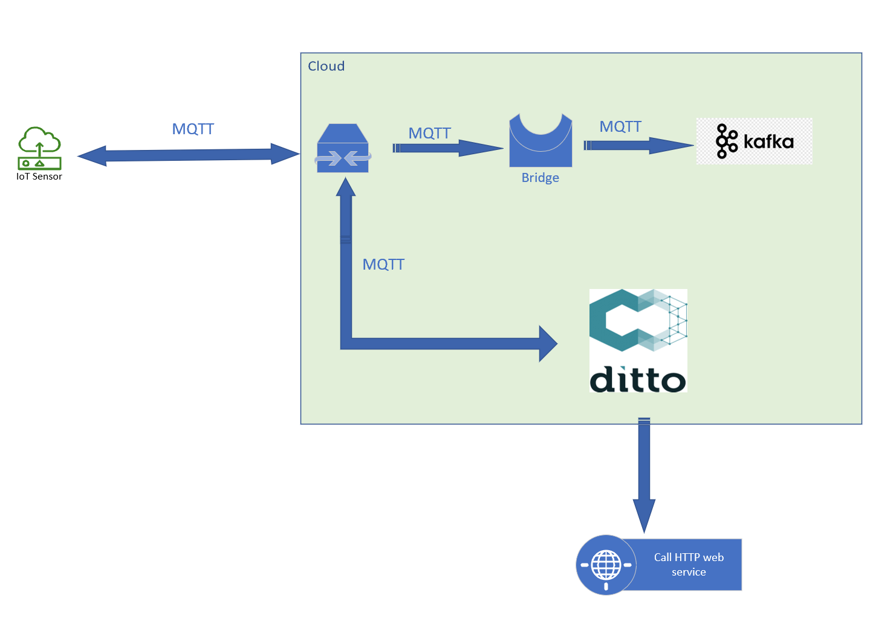

# mqtt-paho-samples

Prerequisite : 

Mosquitto mqtt broker

bridge.py with create a bridge between Mosquitto and kafka

paho.py will help push mqtt telemetry message to MQTT broker

confluent_consumer.py runs on server side to consume events from kafka for further processing 

